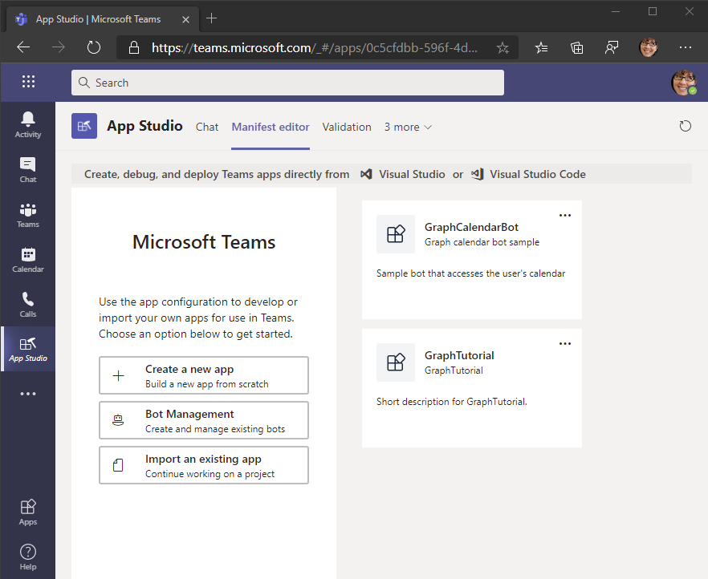
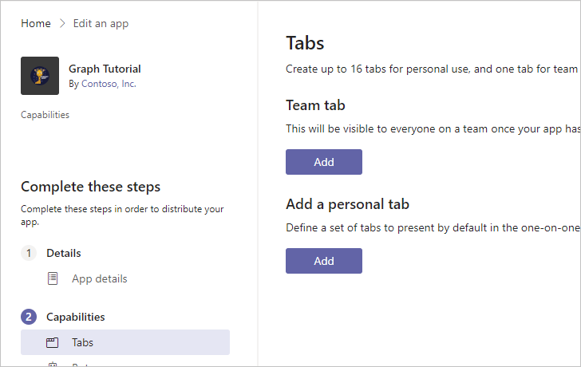

<!-- markdownlint-disable MD002 MD041 -->

El manifiesto de la aplicación describe cómo se integra la aplicación con Microsoft Teams y es necesario para instalar aplicaciones.The app manifest describes how the app integrates with Microsoft Teams and is required to install apps. En esta sección, usará App Studio en el cliente de Microsoft Teams para generar un manifiesto.In this section you'll use App Studio in the Microsoft Teams client to generate a manifest.

1. Si aún no tiene instalado App Studio en Teams, [instálelo ahora](/microsoftteams/platform/concepts/build-and-test/app-studio-overview).If you do not already have App Studio installed in Teams, [install it now](/microsoftteams/platform/concepts/build-and-test/app-studio-overview).

1. Inicie App Studio en Microsoft Teams y seleccione el **Editor de manifiestos**.Launch App Studio in Microsoft Teams and select the **Manifest editor**.

1. Seleccione **crear una nueva aplicación**.Select **Create a new app**.

    

1. En la página de detalles de la **aplicación** , rellene los campos obligatorios.On the **App details** page, fill in the required fields.

    > [!NOTE]
    > Puede usar los iconos predeterminados en la sección de **Personalización de marca** o cargar los suyos propios.You can use the default icons in the **Branding** section or upload your own.

1. En el menú de la izquierda, seleccione **pestañas** en **capacidades**.On the left-hand menu, select **Tabs** under **Capabilities**.

1. Seleccione **Agregar** en **Agregar una ficha personal**.Select **Add** under **Add a personal tab**.

    

1. Rellene los campos como se indica a continuación, donde `YOUR_NGROK_URL` es la dirección URL de reenvío que ha copiado en la sección anterior.Fill in the fields as follows, where `YOUR_NGROK_URL` is the forwarding URL you copied in the previous section. Seleccione **Guardar** cuando haya terminado.Select **Save** when done.

    - **Name:**`Create event`**Name:** `Create event`
    - **Identificador de entidad:**`createEventTab`**Entity ID:** `createEventTab`
    - **Dirección URL del contenido:**`YOUR_NGROK_URL/newevent`**Content URL:** `YOUR_NGROK_URL/newevent`

1. Seleccione **Agregar** en **Agregar una ficha personal**.Select **Add** under **Add a personal tab**.

1. Rellene los campos como se indica a continuación, donde `YOUR_NGROK_URL` es la dirección URL de reenvío que ha copiado en la sección anterior.Fill in the fields as follows, where `YOUR_NGROK_URL` is the forwarding URL you copied in the previous section. Seleccione **Guardar** cuando haya terminado.Select **Save** when done.

    - **Name:**`Graph calendar`**Name:** `Graph calendar`
    - **Identificador de entidad:**`calendarTab`**Entity ID:** `calendarTab`
    - **Dirección URL del contenido:**`YOUR_NGROK_URL`**Content URL:** `YOUR_NGROK_URL`

1. En el menú de la izquierda, seleccione **dominios y permisos** en **Finalizar**.On the left-hand menu, select **Domains and permissions** under **Finish**.

1. Establezca el **identificador** de la aplicación AAD en el identificador de la aplicación desde el registro de la aplicación.Set the **AAD App ID** to the application ID from your app registration.

1. Establezca el campo de **Inicio de sesión único** en el URI del identificador de la aplicación desde el registro de la aplicación.Set the **Single-Sign-On** field to the application ID URI from your app registration.

1. En el menú de la izquierda, seleccione **probar y distribuir** en **Finalizar**.On the left-hand menu, select **Test and distribute** under **Finish**. Seleccione **Descargar**.Select **Download**.

1. Cree un nuevo directorio en la raíz del proyecto denominado **manifest**.Create a new directory in the root of the project named **Manifest**. Extraiga el contenido del archivo ZIP descargado en este directorio.Extract the contents of the downloaded ZIP file to this directory.
