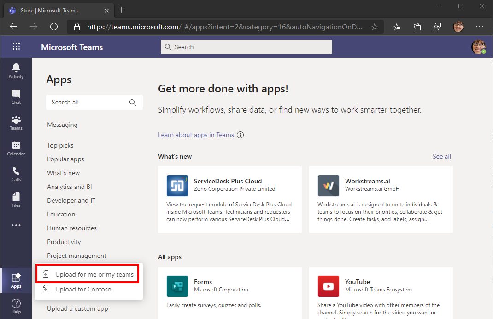

<!-- markdownlint-disable MD002 MD041 -->

En este ejercicio, ampliará la aplicación del ejercicio anterior para que admita la autenticación de inicio de sesión único con Azure AD. Esto es necesario para obtener el token de acceso de OAuth necesario para llamar a la API de Microsoft Graph. En este paso, configurará la biblioteca [Microsoft. Identity. Web](https://www.nuget.org/packages/Microsoft.Identity.Web/) .

> [!IMPORTANT]
> Para evitar almacenar el identificador de aplicación y el secreto en el origen, deberá usar el [Administrador de secretos de .net](/aspnet/core/security/app-secrets) para almacenar estos valores. El administrador de secretos solo se usa con fines de desarrollo, las aplicaciones de producción deben usar un administrador de secretos de confianza para almacenar secretos.

1. Abra **./appsettings.jsen** y reemplace su contenido por lo siguiente.

    :::code language="json" source="../demo/GraphTutorial/appsettings.example.json" highlight="2-8":::

1. Abra su CLI en el directorio donde se encuentra **GraphTutorial. csproj** y ejecute los siguientes comandos, sustituyendo `YOUR_APP_ID` por el identificador de la aplicación del portal de Azure y `YOUR_APP_SECRET` por el secreto de la aplicación.

    ```Shell
    dotnet user-secrets init
    dotnet user-secrets set "AzureAd:ClientId" "YOUR_APP_ID"
    dotnet user-secrets set "AzureAd:ClientSecret" "YOUR_APP_SECRET"
    ```

## <a name="implement-sign-in"></a>Implementar el inicio de sesión

En primer lugar, implemente el inicio de sesión único en el código JavaScript de la aplicación. Usará el SDK de [JavaScript de Microsoft Teams](/javascript/api/overview/msteams-client) para obtener un token de acceso que permita que el código JavaScript que se ejecuta en el cliente de Microsoft Teams realice llamadas Ajax a la API Web que se va a implementar más adelante.

1. Abra **./pages/index.cshtml** y agregue el siguiente código dentro de la `<script>` etiqueta.

    ```javascript
    (function () {
      if (microsoftTeams) {
        microsoftTeams.initialize();

        microsoftTeams.authentication.getAuthToken({
          successCallback: (token) => {
            // TEMPORARY: Display the access token for debugging
            $('#tab-container').empty();

            $('<code/>', {
              text: token,
              style: 'word-break: break-all;'
            }).appendTo('#tab-container');
          },
          failureCallback: (error) => {
            renderError(error);
          }
        });
      }
    })();

    function renderError(error) {
      $('#tab-container').empty();

      $('<h1/>', {
        text: 'Error'
      }).appendTo('#tab-container');

      $('<code/>', {
        text: JSON.stringify(error, Object.getOwnPropertyNames(error)),
        style: 'word-break: break-all;'
      }).appendTo('#tab-container');
    }
    ```

    Esto llama al `microsoftTeams.authentication.getAuthToken` para autenticarse silenciosamente como el usuario que ha iniciado sesión en Teams. Por lo general, no hay ningún mensaje de interfaz de usuario implicado, a menos que el usuario tenga que dar su consentimiento. A continuación, el código muestra el token en la ficha.

1. Guarde los cambios e inicie la aplicación ejecutando el siguiente comando en su CLI.

    ```Shell
    dotnet run
    ```

    > [!IMPORTANT]
    > Si ha reiniciado ngrok y la dirección URL de ngrok ha cambiado, asegúrese de actualizar el valor de ngrok en el siguiente punto **antes** de realizar la prueba.
    >
    > - El URI de redireccionamiento en el registro de la aplicación
    > - El URI del identificador de aplicación en el registro de la aplicación
    > - `contentUrl` en manifest.jsen
    > - `validDomains` en manifest.jsen
    > - `resource` en manifest.jsen

1. Cree un archivo ZIP con **manifest.jsen**, **color.png** y **outline.png**.

1. En Microsoft Teams, seleccione **aplicaciones** en la barra de la izquierda, seleccione **cargar una aplicación personalizada** y, a continuación, seleccione **subir a mí o a mis equipos**.

    

1. Vaya al archivo ZIP que ha creado previamente y seleccione **abrir**.

1. Revise la información de la aplicación y seleccione **Agregar**.

1. La aplicación se abre en Microsoft Teams y muestra un token de acceso.

Si copia el token, puede pegarlo en [JWT.ms](https://jwt.ms). Compruebe que la audiencia (la `aud` notificación) es el identificador de la aplicación y que el único ámbito (la `scp` notificación) es el ámbito de la `access_as_user` API que ha creado. Esto significa que este token no concede acceso directo a Microsoft Graph. En su lugar, la API Web que se va a implementar pronto tendrá que intercambiar este token mediante el [flujo en nombre de](/azure/active-directory/develop/v2-oauth2-on-behalf-of-flow) para obtener un token que funcione con llamadas de Microsoft Graph.

## <a name="configure-authentication-in-the-aspnet-core-app"></a>Configuración de la autenticación en la aplicación principal de ASP.NET

Empiece agregando Microsoft Identity Platform Services a la aplicación.

1. Abra el archivo **./startup.CS** y agregue la siguiente `using` instrucción en la parte superior del archivo.

    ```csharp
    using Microsoft.Identity.Web;
    ```

1. Agregue la siguiente línea justo antes de la `app.UseAuthorization();` línea en la `Configure` función.

    ```csharp
    app.UseAuthentication();
    ```

1. Agregue la siguiente línea justo después `endpoints.MapRazorPages();` de la línea en la `Configure` función.

    ```csharp
    endpoints.MapControllers();
    ```

1. Reemplace la función `ConfigureServices` existente por lo siguiente.

    :::code language="csharp" source="../demo/GraphTutorial/Startup.cs" id="ConfigureServicesSnippet":::

    Este código configura la aplicación para permitir que las llamadas a las API Web se autentiquen en función del token de portador de JWT en el `Authorization` encabezado. También agrega los servicios de adquisición de tokens que pueden intercambiar ese token mediante el flujo en nombre de.

## <a name="create-the-web-api-controller"></a>Crear el controlador de API Web

1. Cree un nuevo directorio en la raíz del proyecto denominado **Controllers**.

1. Cree un archivo nuevo en el directorio **./Controllers** denominado **CalendarController.CS** y agregue el siguiente código.

    ```csharp
    using System;
    using System.Collections.Generic;
    using System.Net;
    using System.Threading.Tasks;
    using Microsoft.AspNetCore.Authorization;
    using Microsoft.AspNetCore.Http;
    using Microsoft.AspNetCore.Mvc;
    using Microsoft.Extensions.Logging;
    using Microsoft.Identity.Web;
    using Microsoft.Identity.Web.Resource;
    using Microsoft.Graph;
    using TimeZoneConverter;

    namespace GraphTutorial.Controllers
    {
        [ApiController]
        [Route("[controller]")]
        [Authorize]
        public class CalendarController : ControllerBase
        {
            private static readonly string[] apiScopes = new[] { "access_as_user" };

            private readonly GraphServiceClient _graphClient;
            private readonly ITokenAcquisition _tokenAcquisition;
            private readonly ILogger<CalendarController> _logger;

            public CalendarController(ITokenAcquisition tokenAcquisition, GraphServiceClient graphClient, ILogger<CalendarController> logger)
            {
                _tokenAcquisition = tokenAcquisition;
                _graphClient = graphClient;
                _logger = logger;
            }

            [HttpGet]
            public async Task<string> Get()
            {
                // This verifies that the access_as_user scope is
                // present in the bearer token, throws if not
                HttpContext.VerifyUserHasAnyAcceptedScope(apiScopes);

                // To verify that the identity libraries have authenticated
                // based on the token, log the user's name
                _logger.LogInformation($"Authenticated user: {User.GetDisplayName()}");

                try
                {
                    // TEMPORARY
                    // Get a Graph token via OBO flow
                    var token = await _tokenAcquisition
                        .GetAccessTokenForUserAsync(new[]{
                            "User.Read",
                            "MailboxSettings.Read",
                            "Calendars.ReadWrite" });

                    // Log the token
                    _logger.LogInformation($"Access token for Graph: {token}");
                    return "{ \"status\": \"OK\" }";
                }
                catch (MicrosoftIdentityWebChallengeUserException ex)
                {
                    _logger.LogError(ex, "Consent required");
                    // This exception indicates consent is required.
                    // Return a 403 with "consent_required" in the body
                    // to signal to the tab it needs to prompt for consent
                    HttpContext.Response.ContentType = "text/plain";
                    HttpContext.Response.StatusCode = (int)HttpStatusCode.Forbidden;
                    await HttpContext.Response.WriteAsync("consent_required");
                    return null;
                }
                catch (Exception ex)
                {
                    _logger.LogError(ex, "Error occurred");
                    return null;
                }
            }
        }
    }
    ```

    Esto implementa una API Web ( `GET /calendar` ) a la que se puede llamar desde la pestaña Microsoft Teams. Por ahora, simplemente intenta intercambiar el token de portador para un token de gráfico. La primera vez que un usuario carga la pestaña, se producirá un error porque todavía no han dado su consentimiento para permitir que la aplicación tenga acceso a Microsoft Graph en su nombre.

1. Abra **./pages/index.cshtml** y reemplace la `successCallback` función por lo siguiente.

    ```javascript
    successCallback: (token) => {
      // TEMPORARY: Call the Web API
      fetch('/calendar', {
        headers: {
          'Authorization': `Bearer ${token}`
        }
      }).then(response => {
        response.text()
          .then(body => {
            $('#tab-container').empty();
            $('<code/>', {
              text: body
            }).appendTo('#tab-container');
          });
      }).catch(error => {
        console.error(error);
        renderError(error);
      });
    }
    ```

    Se llamará a la API Web y se mostrará la respuesta.

1. Guarde los cambios y reinicie la aplicación. Actualice la pestaña en Microsoft Teams. Debe mostrarse la página `consent_required` .

1. Revise el resultado del registro en su CLI. Observe dos cosas.

    - Una entrada como `Authenticated user: MeganB@contoso.com` . La API Web ha autenticado al usuario en función del token enviado con la solicitud de la API.
    - Una entrada como `AADSTS65001: The user or administrator has not consented to use the application with ID...` . Esto es normal, ya que aún no se ha solicitado el consentimiento del usuario para los ámbitos de permisos de Microsoft Graph solicitados.

## <a name="implement-consent-prompt"></a>Solicitud de implementación de consentimiento

Debido a que la API Web no puede preguntar al usuario, la pestaña de Microsoft Teams tendrá que implementar un mensaje. Esto solo tendrá que realizarse una vez para cada usuario. Una vez que un usuario ha dado su consentimiento, no tiene que volver a conceder el consentimiento a menos que revoque explícitamente el acceso a la aplicación.

1. Cree un archivo nuevo en el directorio **./páginas** denominado **Authenticate.cshtml.CS** y agregue el siguiente código.

    :::code language="csharp" source="../demo/GraphTutorial/Pages/Authenticate.cshtml.cs" id="AuthenticateModelSnippet":::

1. Cree un nuevo archivo en el directorio **./páginas** denominado **authenticatee. cshtml** y agregue el código siguiente.

    :::code language="razor" source="../demo/GraphTutorial/Pages/Authenticate.cshtml":::

1. Cree un nuevo archivo en el directorio **./páginas** denominado **AuthComplete. cshtml** y agregue el código siguiente.

    :::code language="razor" source="../demo/GraphTutorial/Pages/AuthComplete.cshtml":::

1. Abra **./pages/index.cshtml** y agregue las siguientes funciones dentro de la `<script>` etiqueta.

    :::code language="javascript" source="../demo/GraphTutorial/Pages/Index.cshtml" id="LoadUserCalendarSnippet":::

1. Agregue la siguiente función dentro de la `<script>` etiqueta para mostrar un resultado correcto de la API Web.

    ```javascript
    function renderCalendar(events) {
      $('#tab-container').empty();

      $('<pre/>').append($('<code/>', {
        text: JSON.stringify(events, null, 2),
        style: 'word-break: break-all;'
      })).appendTo('#tab-container');
    }
    ```

1. Reemplace el existente `successCallback` por el código siguiente.

    ```javascript
    successCallback: (token) => {
      loadUserCalendar(token, (events) => {
        renderCalendar(events);
      });
    }
    ```

1. Guarde los cambios y reinicie la aplicación. Actualice la pestaña en Microsoft Teams. La pestaña debe mostrar `{ "status": "OK" }` .

1. Revise el resultado del registro. Debe ver la `Access token for Graph` entrada. Si analiza ese token, observará que contiene los ámbitos de Microsoft Graph configurados en **appsettings.jsactivado**.

## <a name="storing-and-refreshing-tokens"></a>Almacenamiento y actualización de tokens

En este punto, la aplicación tiene un token de acceso, que se envía en el `Authorization` encabezado de las llamadas a la API. Este es el token que permite que la aplicación tenga acceso a Microsoft Graph en nombre del usuario.

Sin embargo, este token es de corta duración. El token expira una hora después de su emisión. Aquí es donde el token de actualización se vuelve útil. El token de actualización permite que la aplicación solicite un nuevo token de acceso sin que el usuario tenga que iniciar sesión de nuevo.

Debido a que la aplicación usa la biblioteca Microsoft. Identity. Web, no es necesario implementar ninguna lógica de almacenamiento o actualización de tokens.

La aplicación usa la caché de token en memoria, que es suficiente para las aplicaciones que no necesitan conservar los tokens cuando se reinicia la aplicación. Las aplicaciones de producción pueden usar en su lugar las [Opciones de caché distribuida](https://github.com/AzureAD/microsoft-identity-web/wiki/token-cache-serialization) de la biblioteca Microsoft. Identity. Web.

El `GetAccessTokenForUserAsync` método controla la expiración y la actualización de los tokens. Primero comprueba el token almacenado en caché y, si no lo ha expirado, lo devuelve. Si ha expirado, usa el token de actualización almacenado en caché para obtener uno nuevo.

El **GraphServiceClient** que los controladores obtienen mediante la inyección de dependencia está preconfigurado con un proveedor de autenticación que usa `GetAccessTokenForUserAsync` para usted.
